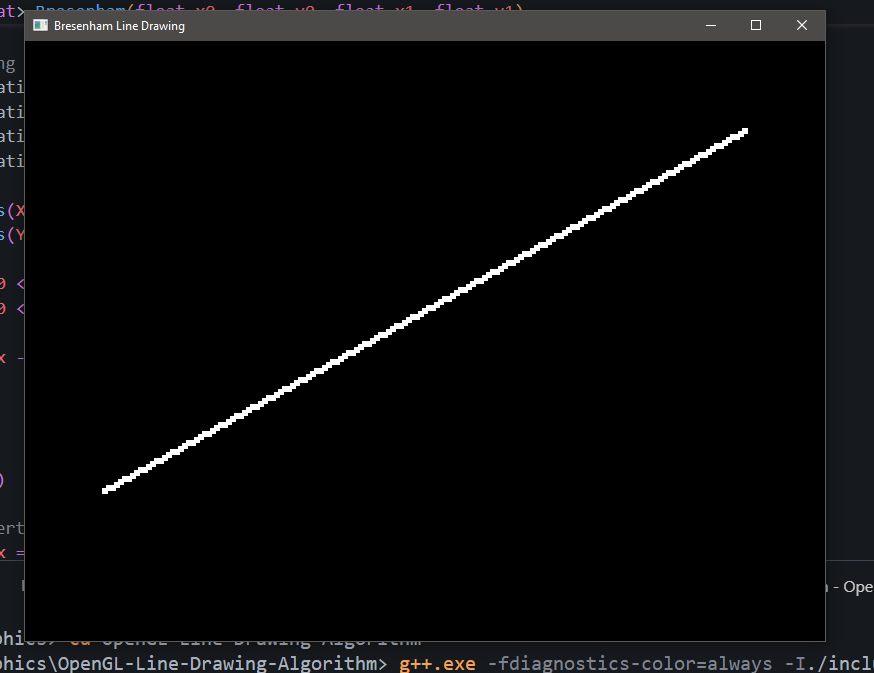

ed

## 🛠️ Built With

- [GLFW](https://www.glfw.org/) – for creating the window and handling input
- [GLAD](https://glad.dav1d.de/) – for managing OpenGL function pointers
- C++ (tested with `g++` on Windows)

---

## 📁 Folder Structure

Output:
